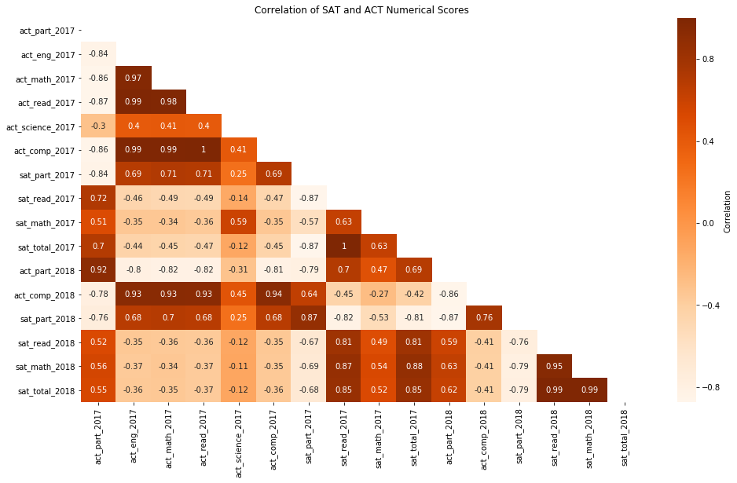

# Project 1: SAT & ACT Analysis

## Table of Contents

[1.0 Directory Structure](#10-Directory-Structure)<br>
[2.0 Project Outline / Problem Statement](#20-Project-Outline-/-Problem-Statement)<br>
[3.0 Description of Data](#30-Description-of-Data)<br>
-[3.1 Size](#31-Size)<br>
-[3.2 Source](#32-Source)<br>
-[3.3 Data Dictionary](#33-Data-Dictionary)<br>
[4.0 Data Visualization](#40-Data-Visualization)<br>
[5.0 Conclusion](#50-Conclusion)<br>
-[5.1 Next Steps](#51-Next-Steps)<br>
[6.0 Outside Sources](#60-Outside-Sources)<br>

## 1.0 Directory Structure

```
.
├── project_1
    ├── code
        ├── starter-code.ipynb
    ├── data
        ├── act_2018.csv
        ├── act_2017.csv
        ├── sat_2018.csv
        ├── sat_2017.csv
    ├── plots
        ├── heatmap_project1.png   
    ├── README.md
    └── sat_project.pdf
```

## 2.0 Project Outline / Problem Statement

In this project we were provided with SAT and ACT test data collected in 2017 and 2018 for 50 USA states plus District of Columbia. The goal was to look at the participation rates for each test. The question posed is: what actions can be taken to increase the participation amoung high school seniours in taking the SAT and ACT test before graduation.

By analysing the data, I have come to the conclusion that participation is highly dependent on the state by state requirement. For the states that require, for example, the student to take the SAT test, the participation is 100%. Same can be observed for the ACT participation. Interestingly, the SAT participation and the ACT participation are negatively correlated. This means that as one goes up the other goes down. 

As a side note, I also noticed that the scores and participation are negatively correlated as well. This could be a question to dive in to deeper in the future. 


---
## 3.0 Description of Data

SAT 2017|SAT 2018|ACT 2017|ACT 2018|
|---|---|---|---|
|State|State|State|State|
|Participation|Participation|Participation|Participation|
|Evidence-Based Reading and Writing|Evidence-Based Reading and Writing|English||
|Math|Math|Math||
|||Reading||
|||Science||
|Total|Total|Composite|Composite|


### 3.1 Size

The SAT data for the year 2017 and 2018 consist of the 51 rows corresponding to USA States plus District of columbia and 4 columns corresponding to participation and scores.  

The ACT 2017 data consisted of 52 entries. It had participation, english, math, reading, science and composite scores for 50 USA stats, District of Columbia and National. I ended up removing the National row for the analysis. The 2018 ACT data consisted of only participation and composite for 50 states and District of Columbia. Original data had Maine twice and one of the Maine entries was removed for the analysis. 


### 3.2 Source

The source of the collected SAT data can be found [here](https://blog.collegevine.com/here-are-the-average-sat-scores-by-state/).
The source of the collected ACT data can be found [here](https://blog.prepscholar.com/act-scores-by-state-averages-highs-and-lows)

### 3.3 Data Dictionary

|Feature|Type|Dataset|Description|
|---|---|---|---|
|**state**|object|act_scores_2017/sat_scores_2017|Gives the name of the USA State.|
|**sat_part_2017**|float|sat_scores_2017|Participation in the test for 2017(percentage). Given in fraction. SAT|
|**sat_read_2017**|int|sat_scores_2017|Evidence-Based Reading and Writing average scores for SAT in 2017|
|**sat_math_2017**|int|sat_scores_2017|Average Math scores for SAT in 2017|
|**sat_total_2017**|int|sat_scores_2017|Total average SAT scores in 2017|
|**act_part_2017**|float|act_scores_2017|Participation in the test for 2017(percentage). Given in fraction. ACT|
|**act_eng_2017**|float|act_scores_2017|Average English scores for ACT in 2017|
|**act_math_2017**|float|act_scores_2017|Average Math scores for ACT in 2017|
|**act_read_2017**|float|act_scores_2017|Average Reading scores for ACT in 2017|
|**act_science_2017**|float|act_scores_2017|Average Science scores for ACT in 2017|
|**act_comp_2017**|float|act_scores_2017|Composite scores for ACT in 2017. Composite is the average of English, Math, Reading and Science scores.| 
|**sat_part_2018**|float|sat_scores_2018|Participation in the test for 2018(percentage). Given in fraction. SAT|
|**sat_read_2018**|int|sat_scores_2018|Evidence-Based Reading and Writing average scores for SAT in 2018|
|**sat_math_2018**|int|sat_scores_2018|Average Math scores for SAT in 2018|
|**sat_total_2018**|int|sat_scores_2018|Total average SAT scores in 2018|
|**act_part_2018**|float|act_scores_2018|Participation in the test for 2018(percentage). Given in fraction. ACT|
|**act_comp_2018**|float|act_scores_2018|Composite scores for ACT in 2018. Composite is the average of English, Math, Reading and Science scores.| 

---
## 4.0 Data Visualization



---
## 5.0 Conclusion

Based on the analysis of the data and looking in to policies the states have set, it is clear that the participation is heavily dependent on the policy of the state. 

The states that require the students to take the SAT will have a 100% participation in the test. However, that usually results in the drop in ACT participation. The states that give the option of either or, result in approximately even participation between the ACT and SAT. 

States who haven't yet made the change to mandatory test participation should look in to doing so. It is possible that one of the factors that plays in benefit to the student is the fact that the test can be taken during school hours and becomes affordable. 


### 5.1 Next Steps

It would be beneficial to study the correlation of ACT vs SAT testing with state average income. Will the income influence which test is favored? Another question we can study is correlation between participation and number of parents/number of working parents. 

Another interesting question: which test is more beneficial for the student. 

---
## 6.0 Outside Sources

- [edweek.com ](https://www.edweek.org/ew/section/multimedia/states-require-students-take-sat-or-act.html)<br>
- [testive](https://www.testive.com/colorado-sat-change-2017/)<br>
- [heatmap mask code](https://towardsdatascience.com/formatting-tips-for-correlation-heatmaps-in-seaborn-4478ef15d87f)<br>
